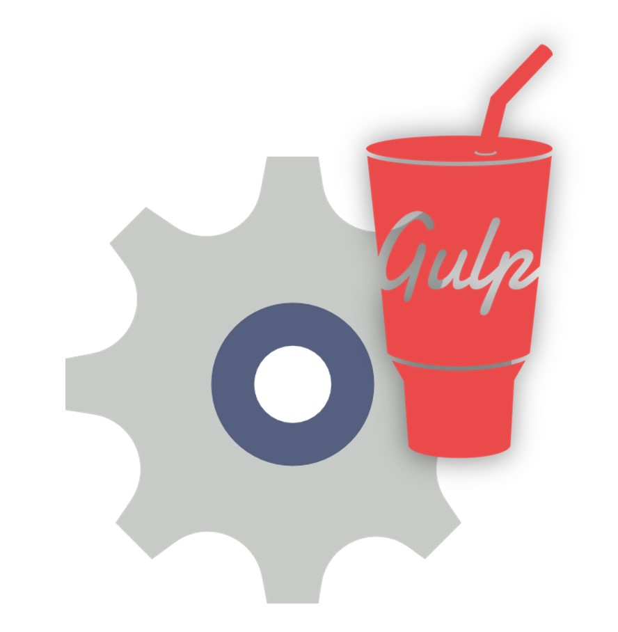

  <h1>Gulp Bucket</h1>
  

Just clone it add your own files sources and make your developing more productive using Gulp with its plugins.

Currently these plugins are installed:
1.  SASS (Compiling SASS files)
2.  SCSS (Compiling SCSS files)
3.  Minifycss (Minifying the SASS or SCSS destionations file)
4.  Coffee (Compiling CoffeeScripts to JavaScript)
5.  Uglify (Minifying the JavaScript or JQuery file)
6.  Plumber (Avoid gulp from stoping and showing the errors in Command Prompt or Command Line itself)
7.  Watch (Watching all the files for changes and reloading the browser)

## Share The Love

I've put a lot of time and effort into making **Gear-It-Gulp** project. If you love it, you can buy me a coffee. I promise it will be a good investment 😉.

**Donate with:** [PayPal](https://www.paypal.me/mittalyashu).
